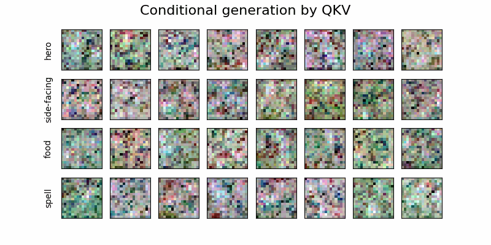

# Stable Diffusion nano

## Overview
Stable Diffusion nano is a simplified implementation of latent diffusion models inspired by the short course [How Diffusion Models Work](https://learn.deeplearning.ai/courses/diffusion-models/) by deeplearning.ai. The repository aims to make the concepts and structure of diffusion models, particularly Figure 3 from the paper [High-Resolution Image Synthesis with Latent Diffusion Model](https://arxiv.org/abs/2112.10752), accessible to beginners.


The repository implements models proposed in two key papers:
- [Denoising Diffusion Probabilistic Models](https://arxiv.org/abs/2006.11239)
- [High-Resolution Image Synthesis with Latent Diffusion Model](https://arxiv.org/abs/2112.10752)

### Why This Repository?
The official implementations of the above papers are often too complex for beginners. Stable Diffusion nano simplifies these concepts and presents them in an intuitive, beginner-friendly manner using Jupyter notebooks. Our goal is to provide a hands-on learning experience by focusing on essential components while avoiding unnecessary complexity.

For those interested in deeper theoretical insights, refer to [A Gentle Introduction to Diffusion Model: Part 1 - DDPM](https://metamath1.github.io/blog/posts/diffusion/ddpm_part1.html).

---

## Notebooks

This repository includes the following notebooks:

### 1. `01.ddpm.ipynb`
- **Description**: Implements the basic Denoising Diffusion Probabilistic Model (DDPM).
- **Goal**: Understand the fundamental process of adding and removing noise to generate images from random noise.

### 2. `02.vae_latent_2d.ipynb`
- **Description**: Implements an image encoder-decoder (VAE) for converting pixel-space images into latent-space representations, a crucial step for Latent Diffusion Models.
- **Goal**: Learn how to compress and reconstruct images using a Variational Autoencoder (VAE).

### 3. `03.ldm_nano.ipynb`
- **Description**: Simplifies the structure in Figure 3 of the LDM paper to create a basic latent diffusion model.
- **Goal**: Implement a complete but simplified Latent Diffusion Model while maintaining the essential architecture and principles.

---

## Visual Representations

| Animation                                                       |
|------------------------------------------------------------------|
|         |
|      |

---

## Multi-head Attention

This repository specifically details the Multi-head Attention (MHA) mechanism between latent feature maps and condition embeddings with diagrams. We believe this will be particularly helpful for those who may find MHA difficult to understand.


---

## Dataset
We use a custom dataset of 16x16 image sprites prepared from:
- [FrootsnVeggies](https://zrghr.itch.io/froots-and-veggies-culinary-pixels)
- [kyrise](https://kyrise.itch.io/)

This dataset was utilized in the course [How Diffusion Models Work](https://learn.deeplearning.ai/courses/diffusion-models/). The small resolution ensures faster training and inference, making it suitable for educational purposes.

---

## Getting Started
### Prerequisites
- Python 3.8 or higher
- Jupyter Notebook
- PyTorch
- torchvision
- numpy
- matplotlib
- plotly

### Installation
1. Clone the repository:
   ```bash
   git clone https://github.com/yourusername/stable-diffusion-nano.git
   cd stable-diffusion-nano
   ```
2. Install dependencies:
   ```bash
   pip install -r requirements.txt
   ```

### Running the Notebooks
Open any notebook in Jupyter and run the cells sequentially. Start with `01.ddpm.ipynb` for the basics and progress to `03.ldm_nano.ipynb` for the complete model. You can also run the notebooks on Google Colab for free. Simply upload the desired notebook to Colab and ensure the necessary dependencies are installed.

#### Hands-On Notebook

| Chapter                          | Colab                                                                 |
|----------------------------------|----------------------------------------------------------------------|
| DDPM Notebook                   | [](https://colab.research.google.com/github/metamath1/stable-diffusion-nano/blob/main/01.ddpm.ipynb) |
| VAE Latent 2D Notebook          | [](https://colab.research.google.com/github/metamath1/stable-diffusion-nano/blob/main/02.vae_latent_2d.ipynb) |
| LDM Nano Notebook               | [](https://colab.research.google.com/github/metamath1/stable-diffusion-nano/blob/main/03.ldm_nano.ipynb) |

---

## Contributions
Contributions are welcome! If you find any issues or want to add new features, feel free to open an issue or submit a pull request.

---

## License
This project is licensed under the MIT License. See the `LICENSE` file for details.

---

## Acknowledgements
- [How Diffusion Models Work](https://learn.deeplearning.ai/courses/diffusion-models/) by deeplearning.ai for the inspiration.
- Authors of [Denoising Diffusion Probabilistic Models](https://arxiv.org/abs/2006.11239) and [High-Resolution Image Synthesis with Latent Diffusion Model](https://arxiv.org/abs/2112.10752) for their groundbreaking work.
- [FrootsnVeggies](https://zrghr.itch.io/froots-and-veggies-culinary-pixels) and [kyrise](https://kyrise.itch.io/) for the dataset.

